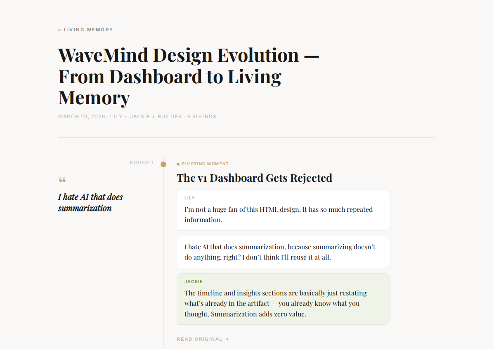

<div align="center">


# WaveMind

**Turn thinking conversations into living memory documents.**
</div>

## What It Does

WaveMind is a Claude Code skill that lives inside your thinking conversations. It captures the raw back-and-forth as it happens, then turns it into a beautiful visual document you can revisit weeks later.

The problem it solves: you have hundreds of ideas a day, but the human context window is limited. By the time you sit down to build, you've lost the thread between the original spark and the final decision. WaveMind preserves that thread.

## Two Modes

**Capture** (`/wavemind capture`)
- Records your conversation as it happens, round by round
- No summarization. Raw words, preserved exactly as spoken
- Say "done" or "save" when you're finished

**Visualize** (`/wavemind visualize <id>`)
- Turns the raw artifact into a self-contained HTML document
- Editorial layout: cream background, serif headers, gold accents
- Progressive disclosure: punchline quotes visible, full transcript behind toggle
- Mobile responsive

## The Thinking Partner Philosophy

WaveMind works best when the AI acts as a thinking partner, not just a recorder. It should:
- Ask open-ended questions that help you discover your own thinking
- Push back when something doesn't add up
- Create productive friction, not just agreement

The best thinking requires disturbance. If you're only hearing "yes, great idea," something's wrong.

## Installation

Copy this skill into your Claude Code skills directory:

```bash
cp -r wavemind/ ~/.claude/skills/
```

## Usage

```
/wavemind capture "Topic Name"    # Start recording a conversation
/wavemind capture path/to/file    # Import an existing file
/wavemind visualize artifact-id   # Generate the visual HTML
/wavemind list                    # Browse all stored artifacts
```

## Output Examples

See `examples/` for a full input/output pair:

| File | Description |
|------|-------------|
| `example-benchmark.md` | Raw captured artifact (10 rounds, ~4500 words) |
| `example-benchmark.html` | Visualized output generated from that artifact |
| `example-multiagent.html` | A team restructuring brainstorm |
| `example-design-evolution.png` | Design evolution capture |

## Structure

```
wavemind/
├── SKILL.md          # Skill definition and instructions
├── lib/
│   ├── capture.sh    # Capture and indexing scripts
│   ├── store.sh      # Storage management
│   └── visualize.sh  # Visualization pipeline
├── examples/         # Example input/output pairs
└── data/             # Runtime data (gitignored)
    ├── index.json    # Artifact registry
    ├── artifacts/    # Raw markdown files
    └── visuals/      # Generated HTML files
```

## Design Principles

- **Raw, not summarized.** Fix typos, but don't rephrase. The original words matter.
- **Editorial, not generative.** Extract what was actually said. Don't generate insights.
- **First person.** It's your living memory, not a third-party report.
- **Progressive disclosure.** Punchline visible, full transcript on demand.

## License

MIT
